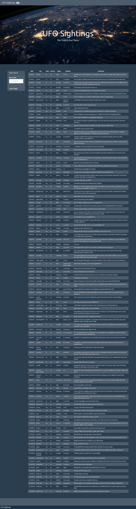

## This project is to create a basic HTML web page and write a code that appends a table to that web page using a dataset in the form of an array of JavaScript objects.

## Technology/Framework used:
* JavaScript
* D3.js

## screenshot of web page - After appending the table:

 

## screenshot of web page - After applying the filter:
